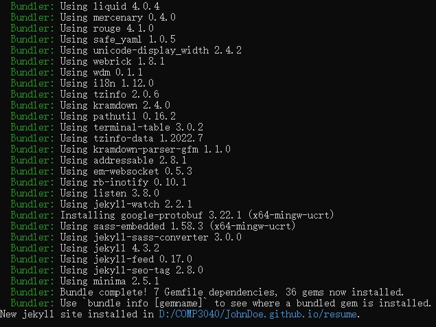
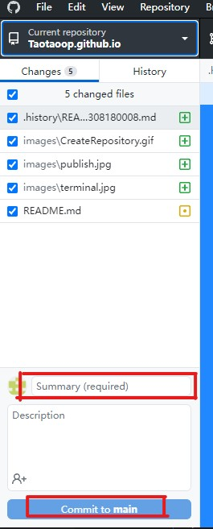
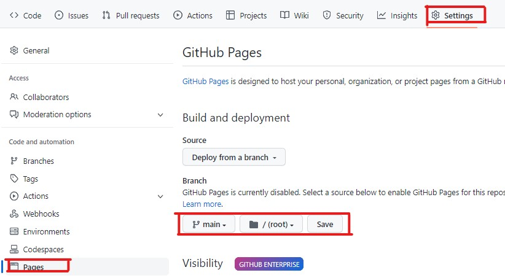
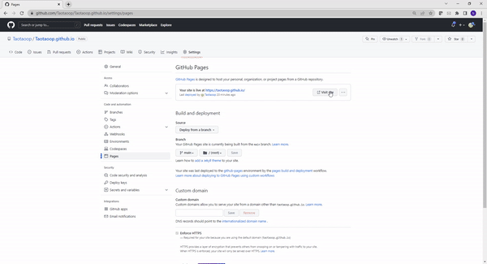

# Hosting Static Resume Website on GitHub
This tutorial includes a step-by-step tutorial on hosting a static resume website using Jekyll on GitHub

[Demo](https://taotaoop.github.io/)
## Purpose
The purpose of this project is to demonstrate how to host and format a resume on GitHub and introduce the general principles of Modern Technical Writing by Andrew Etter
## Prerequisites
- Essential
  - [GitHub Account](https://github.com/join) 
  - [Ruby+Devkit](https://rubyinstaller.org/downloads/) - Latest
  - [Jekyll](https://jekyllrb.com/docs/installation/) - Latest
  - [GitHub Desktop](https://desktop.github.com/) - Latest
- Optional
  - Markdown editor
    </br> You may use any editor of your choosing. For this project, I used **VScode Markdown Plugin** to edit my resume
      - [Atom](https://github.blog/2022-06-08-sunsetting-atom/)
      - [Typora](https://typora.io/)
      - [VScode Markdown Preview Github Styling](https://marketplace.visualstudio.com/items?itemName=bierner.markdown-preview-github-styles)
  
## Step-by-Step Instructions
### Step 1: Register a GitHub Account
Skip to Step 2 if you have already done so.
</br>
- [GitHub Sign up](https://github.com/signup?ref_cta=Sign+up&ref_loc=header+logged+out&ref_page=%2F&source=header-home) : Follow the instructions to create a GitHub account.
- Log in to [GitHub](https://github.com/)
  
### Step 2: Install the Prerequisites
Skip to Step 3 if you have all [prerequisites](#prerequisites) installed.
- Install the following dependencies 
   - [Ruby+Devkit](https://rubyinstaller.org/downloads/) - A programming language that Jekyll is written
  - [Jekyll](https://jekyllrb.com/docs/installation/) - Static website generator 
  - [GitHub Desktop](https://desktop.github.com/) - Simplifies the development workflow
  
### Step 3: Create a Repository
- Sign in with your GitHub account
- Click on **"File"** on the top-left corner, and click **"New repositories..."**
- Fill up relevant information
  - Enter any repository name
  - Decide the local path of where the file will store
  - Optional:
    - Add a README file
    - Choose a license
- Click **"Create Repository"**
  </br>
  </br>
  
### Step 4: Create a Jekyll Template
- Open **"Command Prompt"** by select the Start button then searching **"cmd"** 
- Direct to the local folder created in Step 3 using command ```cd {local path}```  
- Run ```jekyll new {filename}``` to install the Jekyll templete

Your terminal window should look something like this



### Step 5: Upload Resume in Markdown Format
If you do not have a markdown resume yet or do not know how to write a markdown resume. [Markdown Tutorial](https://www.markdowntutorial.com/) and [Markdown cheatsheet](https://github.com/adam-p/markdown-here/wiki/Markdown-Cheatsheet) are some handy tools to start with.
- Copy your Markdown resume 
- Paste into the folder created in step 4
- Copy this line of code and insert it at the top of your markdown resume
```
---
layout: page
permalink: /
---
```

### Step 6: Change the Theme
The default theme for Jekyll is *minima*. More pre-made themes can be found in [Jekyll theme galleries](http://jekyllthemes.org/)
- Open the *_config.yml* file in your folder
- Replace ```theme: minima``` to ```theme: {theme name you desire to use}```
  
**Note:** Visit [Jekyll-remote-theme](https://github.com/benbalter/jekyll-remote-theme) for detailed information on implementing remote theme

### Step 7: Deploy on GitHub
- Go back to GitHub Desktop
- Click **"Publish your branch"**

  
- Fill up the **"Summary"** message
- Commit to the main branch
  
  

At this point, all files should be hosted on your GitHub repository.

### Step 8: Publish your Website
- Go to your GitHub repository
- Navigate to **"Settings"**
- Click on **"Pages"** on the sidebar
- Select the branch you want to use.
- Click **"Save"**
  


## Step 9: Visit your Website
Once Step 7 is done, GitHub will start compiling your project and it may take a few minutes 
- refresh the page after a few minutes
- Click **"Visit site"**



## Run Website Locally
- Open **"Command Prompt"** by selecting the Start button and then searching **"cmd"** 
- Direct to the local folder path created in Step 3 using command ```cd {local path}``` 
- Enter command ```bundle exec Jekyll serve``` 

Your window should look something similar to this


- Copy the URL in **"Server address"**
- Paste into any web browser
## More Resources
- [Markdown Tutorial](https://www.markdowntutorial.com/)
- [Markdown Cheatsheet](https://github.com/adam-p/markdown-here/wiki/Markdown-Cheatsheet)
- [Modern Technical Writing: An Introduction to Software Documentation](https://www.amazon.ca/Modern-Technical-Writing-Introduction-Documentation-ebook/dp/B01A2QL9SS)
- [Jekyll Theme galleries](https://jekyllthemes.io/)
- [Jekyll Docs](https://jekyllrb.com/docs/)
## Acknowledgment
- Theme
  - [minima](https://github.com/jekyll/minima)
- Group members
  - Tushar Goyal 
  - Jiale Li 
  - Arshdeep Singh Sahota 
## FAQ
Q: Why is Markdown better than a word processor

A: Markdown is a lightweight markup language. It is easier and faster than word processors, and it guarantees to open in the same format anywhere.

Q: Why is my resume not in format?

A: Make sure the baseurl and url are set up correctly in *_config.yml*. And check if your choice of theme is [supported](https://pages.github.com/themes/) on GitHub

Q: Why host your resume on GitHub?

A: Hosting your resume on GitHub is a good way to demonstrate your programming skill to employers and it is easier for them to access your resume.
## Concepts of Etter's Book
### Use Lightweight Markup
- As Andrew Etter said in Modern Technical Writing *"One of the tenets of modern technical writing is that everyone is a contributor"*. Lightweight markup languages like Markdown eliminate the barriers of price, learning curve, and portability. First, the markdown content is human-readable in raw form, it is clear and easy to read and write. Second, markdown keeps the consistent format on any system. No matter what text editor you use, you will always see the same effect. And because of this, Markdown can be easily transformed into other formats such as PDF, HTML, DOCX, etc. These features of Markdown encourage people to contribute, as all barriers are removed. To encourage our audiences to use Markdown, the README and resume files of this project are both formatted in Markdown and a Markdown tutorial link is also included in [Step 5](#step-5-upload-resume-in-markdown-format). 
### Use Distributed Version Control
- Andrew Etter has extolled the benefits of distributed version control systems in his book. DVCS allows offline and concurrent work on the same file. It provides us with the ability to track and recover any modifications of our project. And it encourages developers to contribute or re-produce. Although it has some drawbacks but it is still a very powerful tool. In this project, we have demonstrated the use of GitHub and GitHub Desktop to create and edit our repository in [Step 3](#step-3-creat-a-repository), and [Step 7](#step-7-deploy-on-github).
### Make Static Websites
- Andrew Etter also mentions the benefits of static websites. It is fast, simple, portable, and secure. Hosting static websites and GitHub pages has no server-side application dependencies, no databases, and nothing to install. The static website generator can provide us with the ability to create static websites without much coding knowledge. It will automatically generate a static website based on lightweight markup content and the theme of your choice. In this project, we demonstrate how to create a static website with Jekyll. Creating the Jekyll template and changing the theme is done in [Step 4](#step-4-create-a-jekyll-template) and [Step 6](#step-6-change-the-theme)
